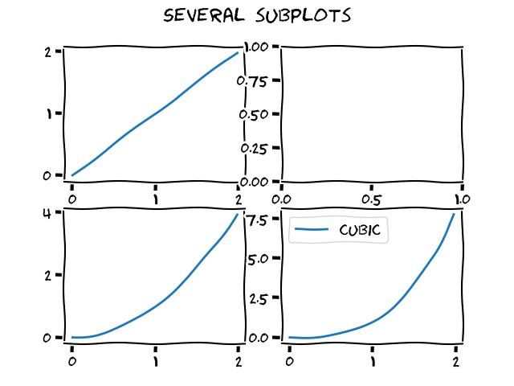

# XKCD

Если вы тоже любите комиксы [XKCD](https://xkcd.com/) (годный перевод [тут](https://xkcd.ru)), можете попробовать рисовать графики в том же стиле. Это несложно.

Matplotlib умеет в этот стиль "из коробки", даже ничего ставить не надо. Просто пишете строчку plt.xkcd() как в xkcd.py, и оно само сработает.

Один нюанс - если у вас в системе нет нужного ему шрифта, то буквы и цифры будут обычные, скучные. На этот случай шрифт Humor-Sans.ttf прилагается. Вам нужно загуглить, как установить его в вашу систему (то есть в какую папочку скопировать файл), и тогда уже точно все сработает. 
